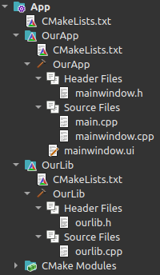

This repository contains sample code for and an article about using CMake-based subdirectory projects in Qt Creator.

The sample code is in the `App` directory, while the article can be read [here](article/qt_cmake_multidir.pdf), in the `article` directory.
